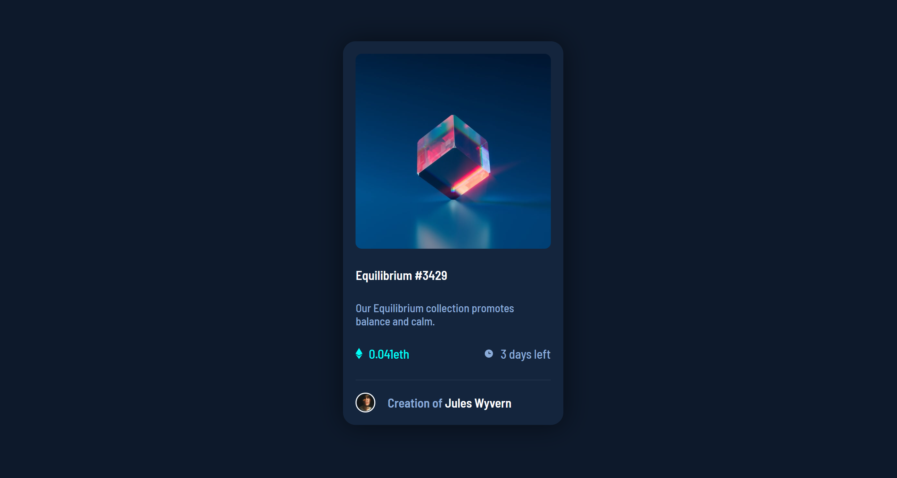

# Frontend Mentor - NFT preview card component solution

This is a solution to the [NFT preview card component challenge on Frontend Mentor](https://www.frontendmentor.io/challenges/nft-preview-card-component-SbdUL_w0U). Frontend Mentor challenges help you improve your coding skills by building realistic projects. 

## Overview

This project was designed to test your CSS and HTML knowledge along with showing hover state changes.

### The challenge

Users should be able to:

- View the optimal layout depending on their device's screen size
- See hover states for interactive elements

### Links

- Live Site URL: [Add live site URL here](https://nft-preview-card-equilibrium.netlify.app/)

## My process

At first I was planning to use Sass but then I thought that because it was a small project, CSS with some Utility classes would suffice. Once I had the initial classes in the HTML, I ended up deleting a few as I was failing to adhere to the 'Do not repeat yourself' philosophy. 

### Built with

- Semantic HTML5 markup
- CSS custom properties
- Flexbox
- Mobile-first workflow

### What I learned
 
It is tempting, even with small projects to write as much code as possible, to unnecessarily over complicate the project. More code does translate into a better App or project.

I also became a little stuck on the hover state regarding the hero-image. It took a while and a little research to figure out that making an overlay component would be a viable solution. One to remember for future projects!

### Continued development

Onwards and upwards to the next project.

## Author

Simon Maher

- Frontend Mentor - [@ySi-maher](https://www.frontendmentor.io/profile/yourusername)

